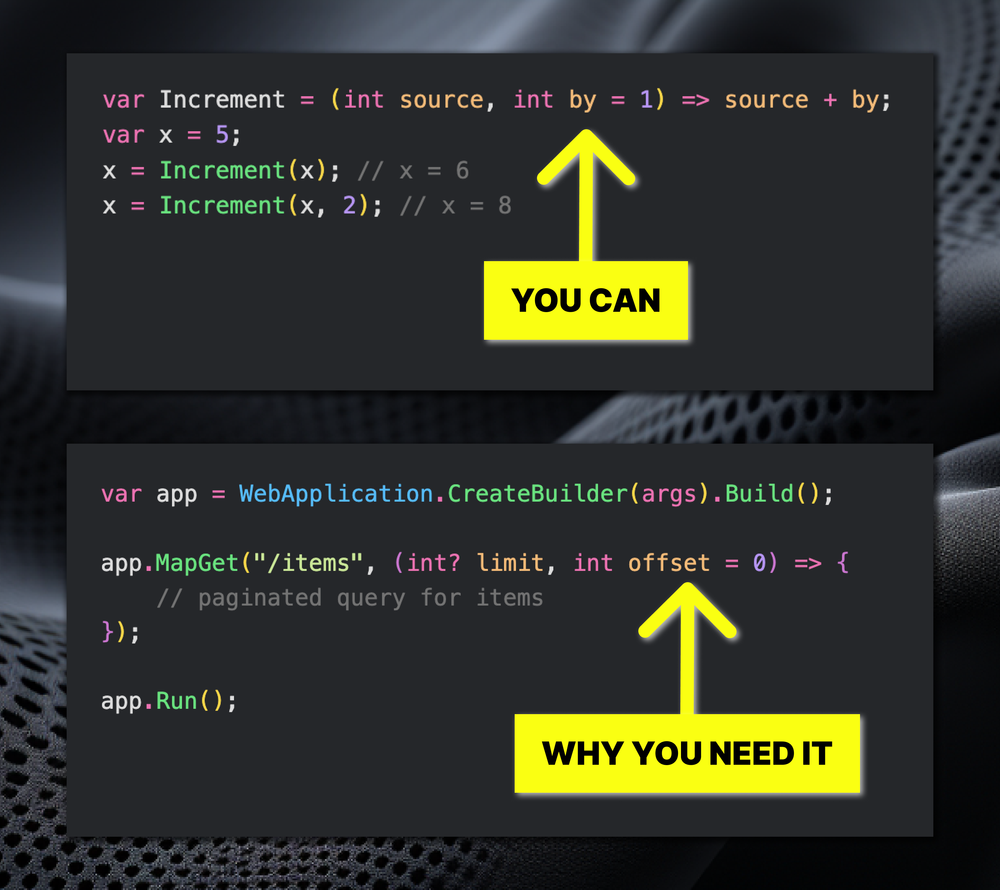

# Brief

- Clickbait: The new C# feature you may need 👀
- Context: Continuing C# 12 features review
- The what: Optional lambda parameters
- Intrigue: At first, I thought this one was not really useful
- Point: Diving into docs have found a use case that is actually very common: minimal api.
- Call To Action: Hit the like if you find that feature may increase your productivity!

# Text 

The new C# feature you may need 👀

Continuing our journey on C# 12 features, it's time to talk about the last one in the list so far: optional lambda parameters. So, now you can provide default values for parameters on lambda expressions,
just like in methods and local functions!

Now, let's talk about the implications. 🤔  
At first, I thought that it didn't bring much. Where would you use lambda with some arbitrary arguments, anyway? But diving into the docs, I've found a use case that is indeed very realistic. Minimal APIs! They revolve around lambdas. And this feature provides an elegant way to set a default value for a request parameter.

Did you also think this feature was kind of useless?
Do you think the feature will increase your productivity? Hit the 👍 button if you find the post useful in any way, and keep coding!

