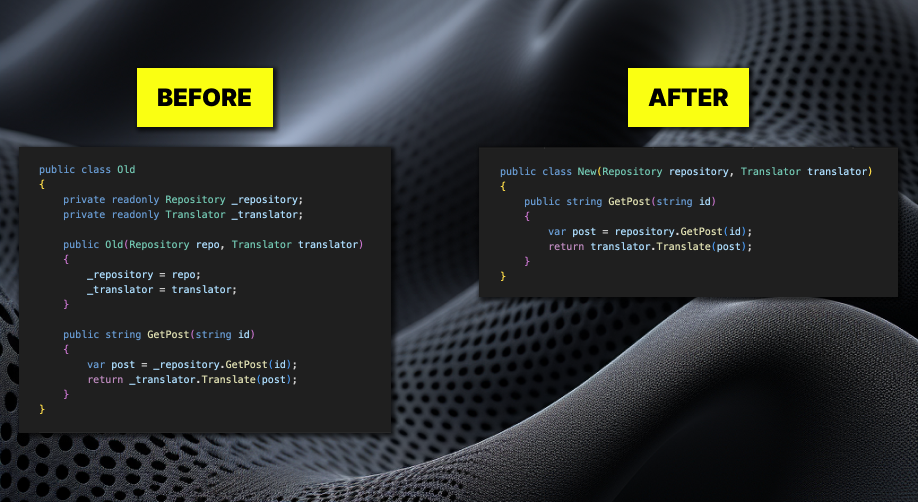
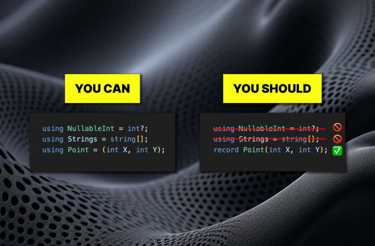
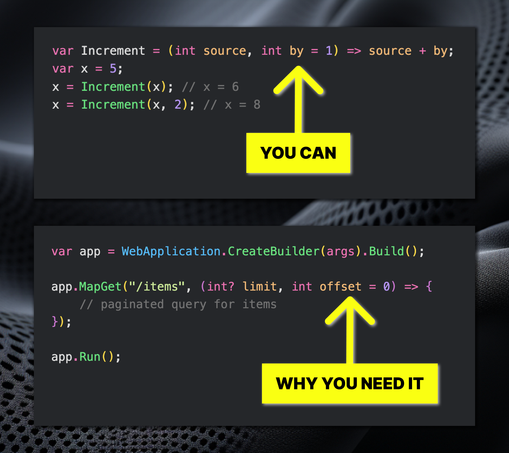

# C# 12: What do we know so far?

~~Winter~~ November is coming, and C# 12 version is coming along with it. Let's peek into features that have been announced already and discuss their impact. To the code! 🚀

## Primary constructors for classes

Primary constructors were introduced in C# 9 along with records. And now, they are making their way to classes and structs! Primary constructor parameters of a class will act as class-scoped parameters rather than class members. This shift can greatly reduce class boilerplate. You can see in the picture below that even in the most trivial example, it saves a whopping 7! lines of code. So, what can go wrong?

Well, as I already said, primary constructors in classes act very differently from primary constructors in records. In records, the constructor parameters become immutable, public class members as properties. And the class's primary constructors are different in literally every aspect. They are mutable, class-scoped, and act as function parameters. So, a lot of people raised concerns with this inconsistency. In fact, the most liked comment on Nick Chapsas's video regarding this feature is the following:

"We're about two C# versions away from a certification exam dedicated solely to object creation and initialization." (c) (YouTube comment)

Personally, I'm excited about this new constructor feature as I always strive to reduce code size. And this is definitely a step in the right direction. And although I understand the raised concerns, I believe it is worth it. I always cheer for C#, but the redundancy of declaring private fields and duplicating them as constructor parameters, and later assigning them has bothered me for a long time. I still think there's a long way for the feature to be polished enough, but I think it's headed in the right direction.

## Alias any type

With this feature, the C# language team removes the limitation of aliases to be allowed only for named types. So now, one can use it to alias: tuples types, array types, and nullable value types in short form. But here's the catch, do we really need it? 🤔

Let's start one by one:
- `using DatabaseInt = int?`. Why would one do that? It's essentially an extra code producing extra code and confusing people with a new type. I think we should avoid this.
- `using IntArray = int[]`- The same here: Why?
- `using Point = (int X, int Y)`. This one is more complicated. It seems tempting to essentially declare a new short type in one line. So, what's wrong? Well, the alias will only be scoped to a file or a project if used with the "global" keyword. The good news is **record Point(int X, int Y)** will accomplish practically the same but can be reused in multiple projects.

In the end, I would like to still cheer for the C# team for making the alias feature complete, despite the fact I don't see a real-life scenario for using it.

## Optional lambda parameters

Now you can provide default values for parameters on lambda expressions, just like in methods and local functions! Let's talk about the implications. 🤔  

At first, I thought that it didn't bring much. Where would you use lambda with some arbitrary arguments, anyway? But diving into the docs, I've found a use case that is indeed very realistic. Minimal APIs! They revolve around lambdas. And this feature provides an elegant way to set a default value for a request parameter, as you may see in the picture above!

## Conclusion

The C# team has so far shown us three new features. I would say that only one of them is kind of major. But the one (primary constructor for classes) will change the way we write C# in a big way! Let me think what you think about the new features in the comments below! And always remember that the C# team also accepts your feedback in the language repo. 
