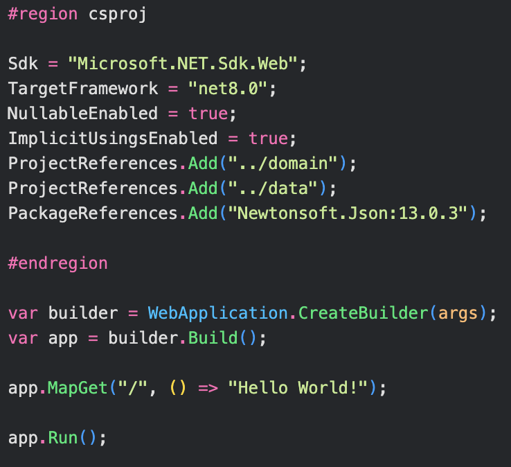
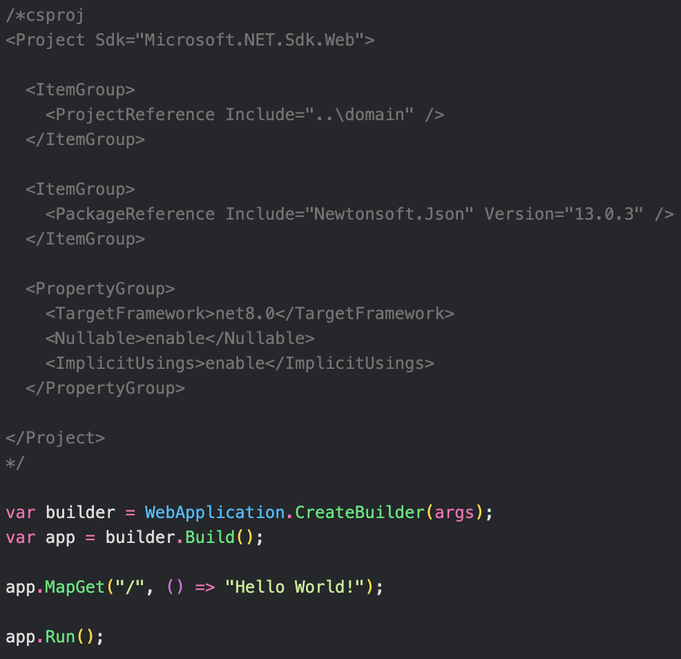

# C# without csproj files 

> Let's get rid of the csproj files! 😉

I'm an all-around minimalist. But C# has historically never been a minimalistic language. Gladly, it has changed a lot in the latest versions with top-level statements, primary constructors, and many more recently added features. However, it's still rarely considered to be a language for quick prototyping or scripting. And it may be one of the reasons why it's lacking behind python in the popularity contest.

I feel like the main blocker is the necessity for a csproj file for any C# program. Let's fantasize about how we can get rid of it in this post. I'll focus on solutions where we persist all the information csproj files contain but in the project's entry point file - `Program.cs` file instead. Here are my two ideas:

- We'll have a special region or, even better, a dedicated compiler directive. Inside the directive, we'll have access to the C# variables that match csproj parameters. I'll like that we'll utilize standard C# syntax here and drop the outdated XML format. However, it may be a bit tricky to parse the file for the compiler and IDEs. It will require very specific IntelliSense support. Also, it may be a little bit complicated to explain to the newcomers. But from the learning curve perspective, it seems similar to the already accepted top-level statements with their `args` variables.

- We'll have a special comment that will be parsed by the compiler. Inside the comment, we'll just have the csproj file content. That seems to have a lower learning curve and is easier to implement. But it continues the wrong bet on the XML format, which is losing its popularity and for a good reason: it's clunky and verbose.

